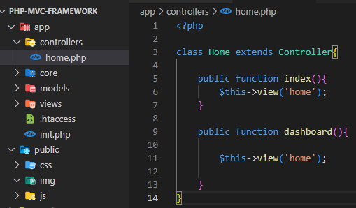
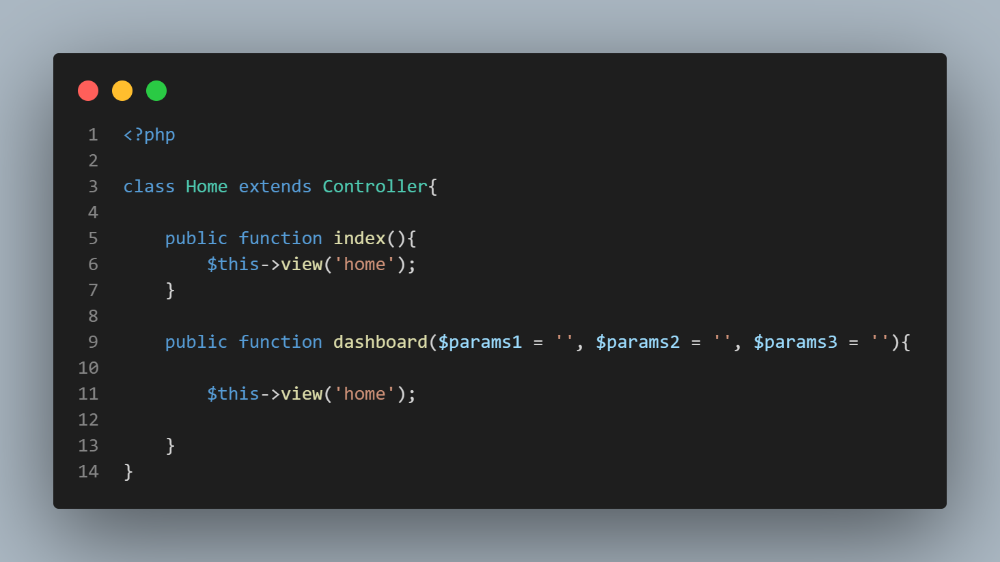

# php-mvc-framework

This is a small PHP mvc framework and it works very simple 

## How to use?

- First is that there is no routes file unlike laravel or other php frameworks

- Let's take a look in a simple url

        https:example.com/home/method/params1/params2/
    
- The first parameter of the url (which is home) will going to find if it's exist in the controller folder.

- The name of the url should be the same to the file (file extension is not included), and the class name as well

    

- If it's exist (home) then it will open it or it run the class and it will execute the method base on the second parameter (which is the method).

- If the first parameter (which is home) did not exists on the controllers then it will automatically open the home as the default file, and the first parameter will become the method

## Example

        https://example.com/dashboard/params1/params2/params3

- If the parameter is exists on the method then it will execute it, but if did not exists then it will automatically execute index as the default method.

- This is the example to pass the value of parameters to method

    