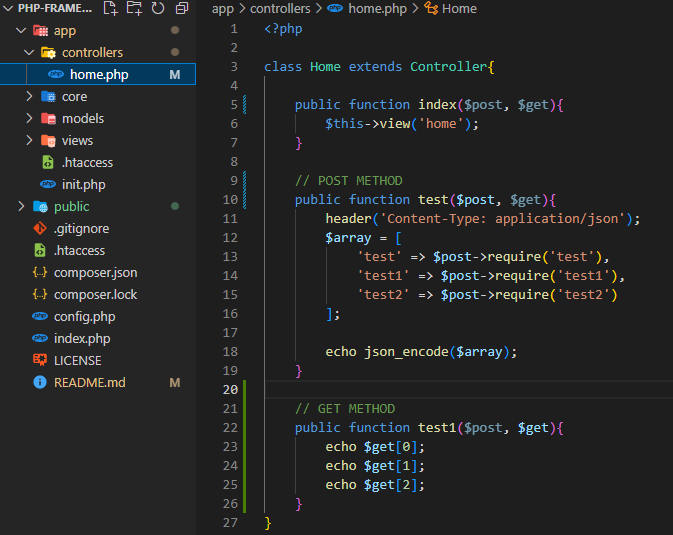

# php-mvc-framework

This is a small PHP mvc framework and it works very simple 

## How to use?

- First is that there is no routes file unlike laravel or other php frameworks.

- Let's take a look in a simple url.

        https:example.com/home/test1/params1/params2/params3
    
- The first parameter of the url will going to find if it's exist in the controller folder.

- The name of the url should be the same to the file and the class name as well.

    

- If it's exist then it will open it or it run the class and it will execute the method base on the second parameter.

- If the first parameter did not exists on the controllers then it will automatically open the home as the default class or first parameter.

- If the second parameter is exists on the method then it will execute it, but if did not exists then it will automatically execute index as the default method or second parameter.

- This is the example to pass the value of parameters to method

    

## Example #1

        https://example.com/home/test1/params1/params2/params3

        home - name of the class
        test1 - name of the method
        params1, params2, params3 - the parameter

## Example #2

        https://example.com/test1/params1/params2/params3

        home - is the default class
        test1 - name of the method
        params1, params2, params3 - the parameter

## Example #3

        https://example.com/params1/params2/params3

        home - default class
        test1 - default method
        params1, params2, params3 - the parameter